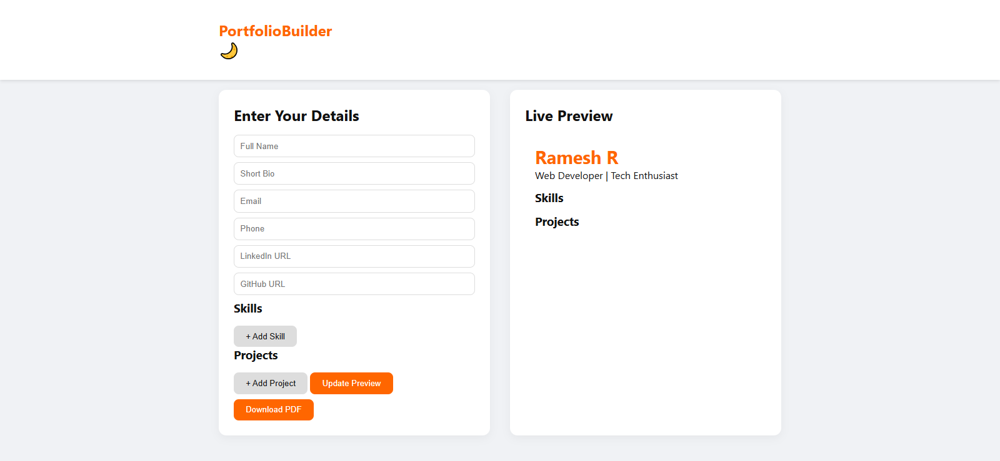

# Portfolio Builder / Resume Generator

An interactive portfolio builder & resume generator built for **Ramesh R**.

## ✨ Features
- Add personal info (Name, Bio, Contact, Social Links)
- Add multiple skills & projects dynamically
- Live portfolio preview
- Light/Dark mode toggle
- Export portfolio as PDF
- Responsive design

## 🛠️ Tech Stack
- HTML
- CSS
- JavaScript
- jsPDF (for PDF export)

## 📸 Screenshots


## 🚀 How to Use
1. Clone the repository:
   ```bash
   git clone https://github.com/ramesh-852000/portfolio-builder-and-resume-generator.git
